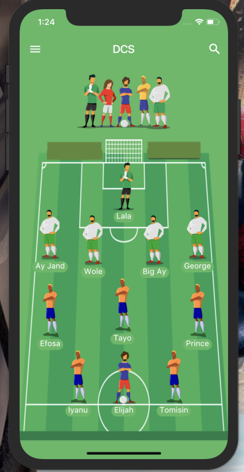

# fantasy_football

A Flutter Project For Fantasy Football League. 

The team used in this project is in reference to my team mates in Redeemer's University Divine Champions.

## Preview

This is a sample of how the project view looks like.

## Getting Started

The generated folder in lib which hosts the i18n.dart was not added because this folder is automatically generated by IntelliJ IDEA.

Install the dependencies by running "flutter packages get" in the project directory.

Run main.dart or "flutter run" on either an Android Emulator / iOS Simulator or an attached  Android Target Device / iOS Device 
